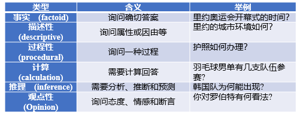
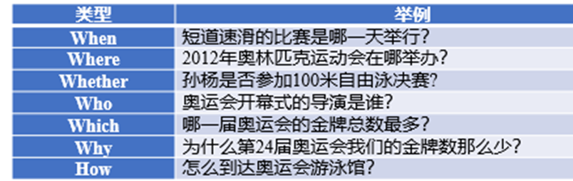
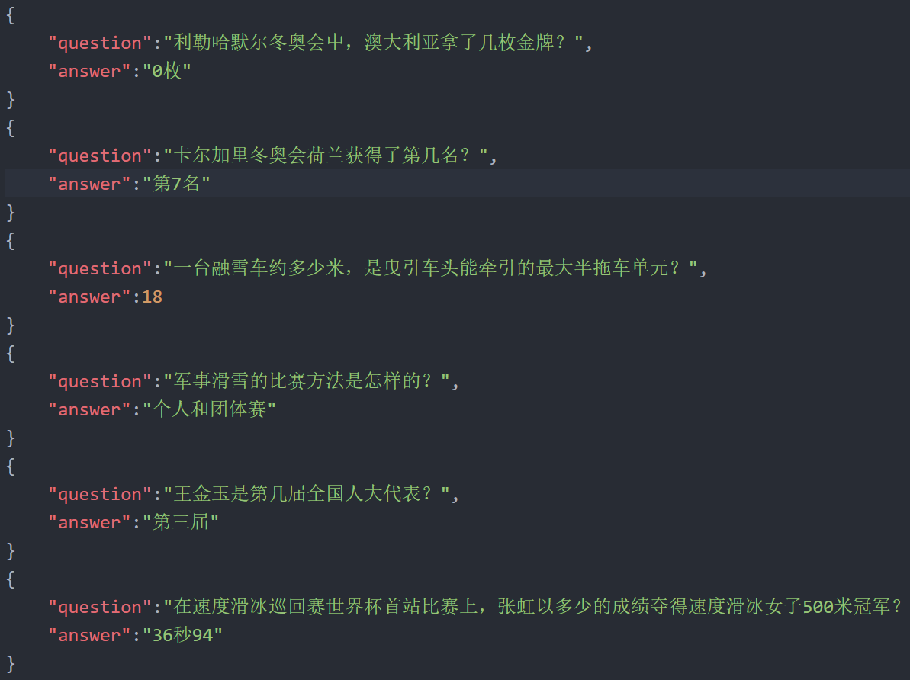

## 人工智能基础大作业——冬奥会知识问答机器人
--- 

文件|说明
-|-
QA_module_0|QA模型0
QA_module_1|QA模型1
QA_module_2|QA模型2
QA_module_3|QA模型3
QA_module_kb|QA模型伪知识库

---

**注意**    
测试时请使用QA_module_3，使用方法见QA_module_3/Readme.md

---

 
## 人工智能基础大作业报告——冬奥会问答机器人
张磊，康齐瀚，张闻祎，郭豪  

---     

**一、任务描述及任务背景:**   
问答系统(Question Answering System, QA)是信息检索系统的一种高级形式。它能用准确、简洁的自然语言回答用户用自然语言提出的问题。问答系统是目前人工智能和自然语言处理领域中一个倍受关注并具有广泛发展前景的研究方向。中文问答系统需要在现有的中文信息处理技术基础上，充分研究和利用问答的特性与需求，通过各种方法解决和克服(或暂时回避)以上难点和困难，设计和开发问答系统。     
**任务要求：**
1.	系统模型以[检索式对话系统]或者[检索+生成式对话系统]为主
2.	可选择使用所提供的训练语料和知识图谱，也可自己增加冬奥会数据集
3.	输入输出要求：  
a)	输入输出分别以json格式{“answer”: “…”, “question”: “…”};     
b)	单次响应时间在500ms以内（除去模型加载时间）；   
c)	成绩评测：测试语料返回正确答案的可接受率；
数据描述：
1.	训练数据：
训练数据提供1-16k标注好的问答对，包括问题，答案，问句类型，领域类型，语义类型等信息。问句类型包括6类，如图1所示，问题一共有7类，分类展示在图2中。
    
   
图1 问句类型    
 
图2 问题类型

   

2.	测试数据
由于我们组实现的是基于检索式的问答系统，因此对于完全不同的问题来说是无法给出有效的答案的，因此测试数据从训练数据中随机选出了100条写入test.xlsx文件中，并且手动地对其中的表述方式进行了修改，以测试系统的鲁棒性。
测试数据的格式为修改后的问题+正确答案，对问答系统进行测试的时候，会使用AI产生的答案和预设的答案进行比对，统计正确的答案数量以估计准确率。

3.	输出数据
根据实验要求，输出的数据为json格式的问答对，因此每次进行一轮测试之后，会在根目录下面生成一个output.json文件（如果之前存在这个文件，会被覆盖）。Json文件中，每个元素分为”question”和”answer”两个标签：  
 

    
图3 输出格式示例

   

4.	辅助数据
在最终提交的方案里面，使用了jieba分词库进行中文的分词。在进行测试的时候发现，原生的分词词典会把部分专有名词分开，比如说xxx（地名）冬奥会等，在计算相似度的时候可能会出现不同地点举办相同赛事的冬奥会问答对出现相似度偏高的情况，因此根据jieba分词作者的描述手动增加了部分分词词典。由于本实验是冬奥会知识的问答系统，因此这些专有名词出现的词频应该较高，预设的词频也就比较高了。   

    
图4 辅助数据

--- 

**二、任务分工**
1. 实验报告：4人共同完成；
2. 模型实现:

    

模型编号 | 实现者
:-: | :-: | :-:
__QA模型0__ | _张磊_
__QA模型1__ | _康齐瀚_
__QA模型2__ | _张磊_
__QA模型3__ | _郭豪_
__伪知识库__ | _康齐瀚_

3. 测试程序：张闻祎;   
4. 测试数据：张闻祎；

---
**三、参考文献**    
[1] https://github.com/OpenNMT/OpenNMT-py   
[2] https://github.com/fxsjy/jieba  
[3] https://github.com/RaRe-Technologies/gensim     
[4] https://github.com/scikit-learn/scikit-learn

---